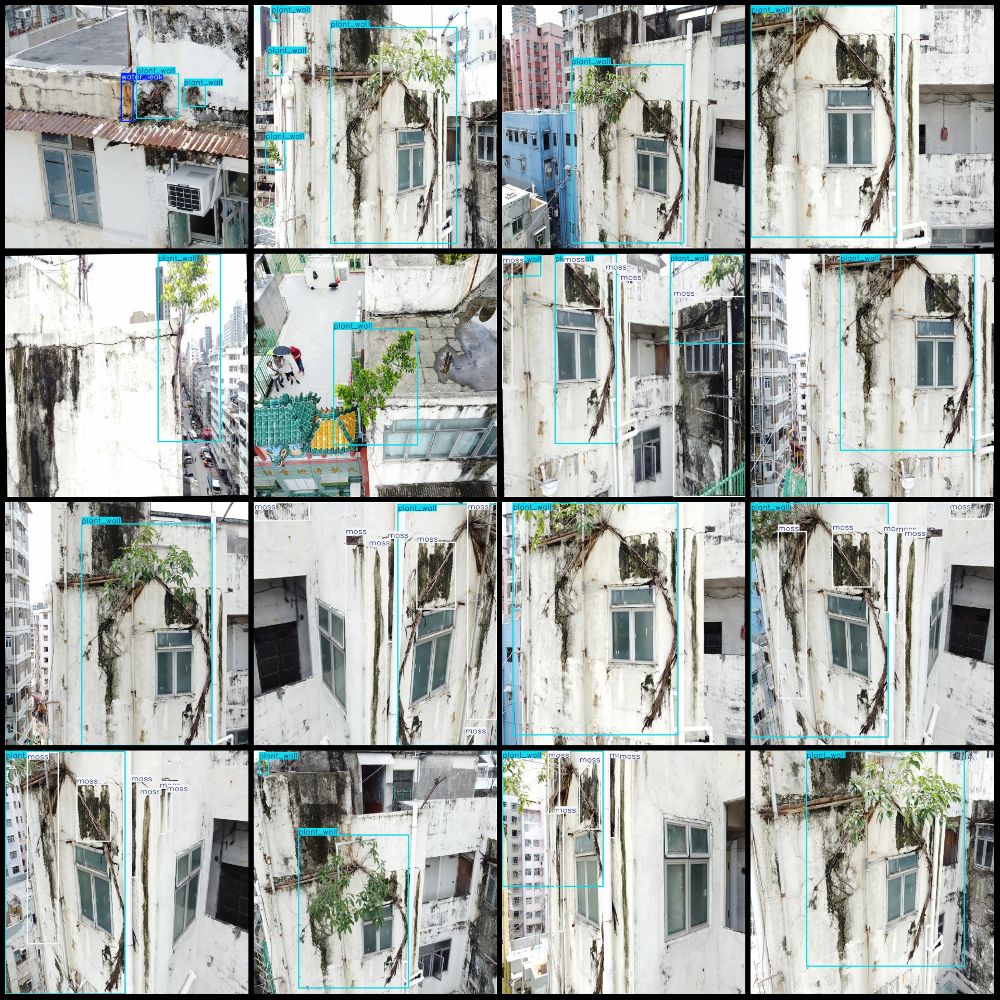
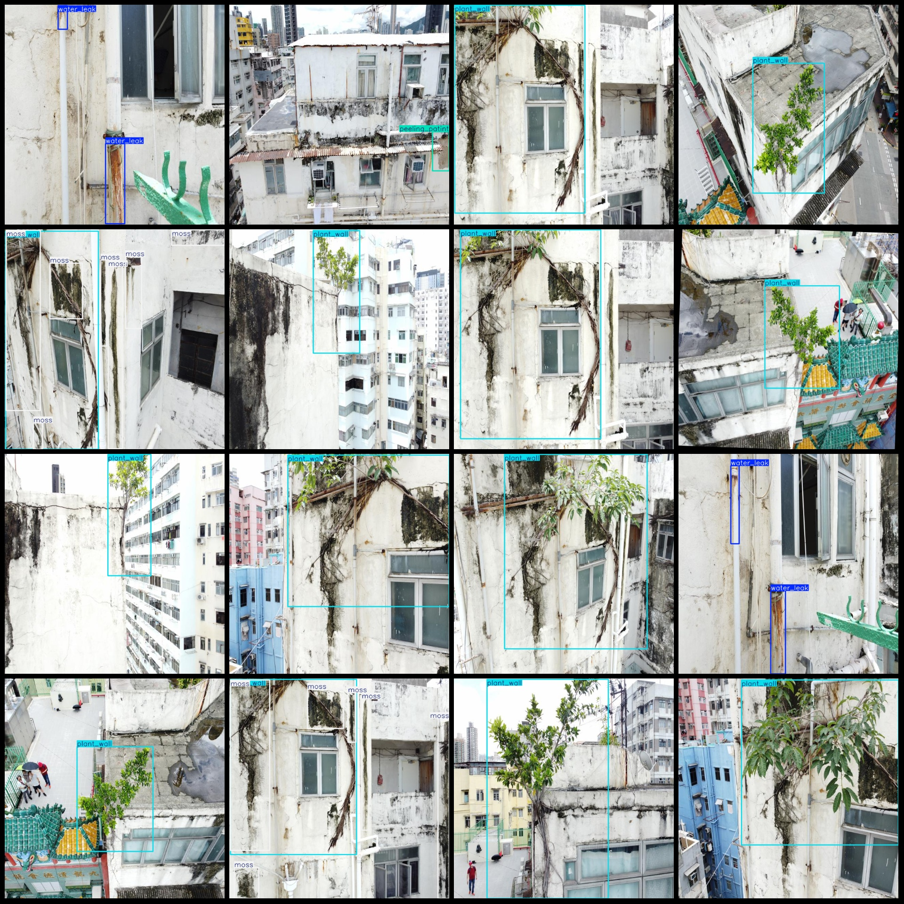

# Intelligent Building Wall Mold, Water Leakage and Plant Detection Dataset in VOC+YOLO Format with 238 Images in 4 Categories

Dataset Format: Pascal VOC format + YOLO format (excluding the split path in the txt file, only including jpg images along with corresponding VOC format xml files and YOLO format txt files)
Image Count (Number of jpg files): 238
Annotation Count (Number of xml files): 238
Annotation Count (Number of txt files): 238
Number of Annotation Categories: 4
Annotation Category Names: ["moss", "peeling_paint", "plant_wall", "water_leak"]
Each category has a number of bounding box frames:
moss (Mold) = 222
peeling_paint (Peeling) = 76
plant_wall (Wall plant) = 296
water_leak (Water leak) = 45
Total bounding box frames: 639
Image Resolution: 640x640
Annotation Tool Used: labelImg
Annotation Rules: Draw bounding boxes for each category
Important Notice: No guarantee is made regarding the accuracy of the trained models or weight files.
Picture Preview:
Annotation Example:

## Images

Here is a pay link on Stripe ( https://buy.stripe.com/3cs8yP7sY87d0vu9AB ). Please contact me lonlonago@foxmail.com after funding $89, and I will send you a complete data files , thank you!

